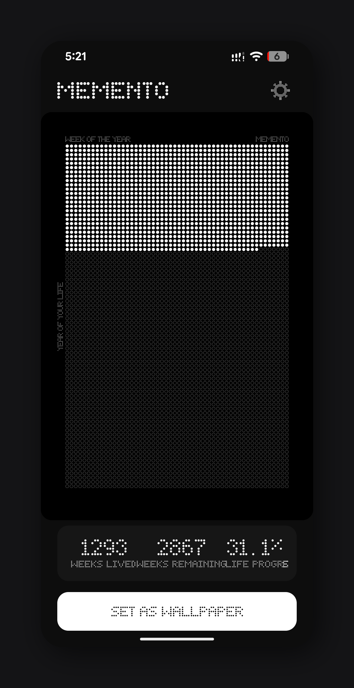
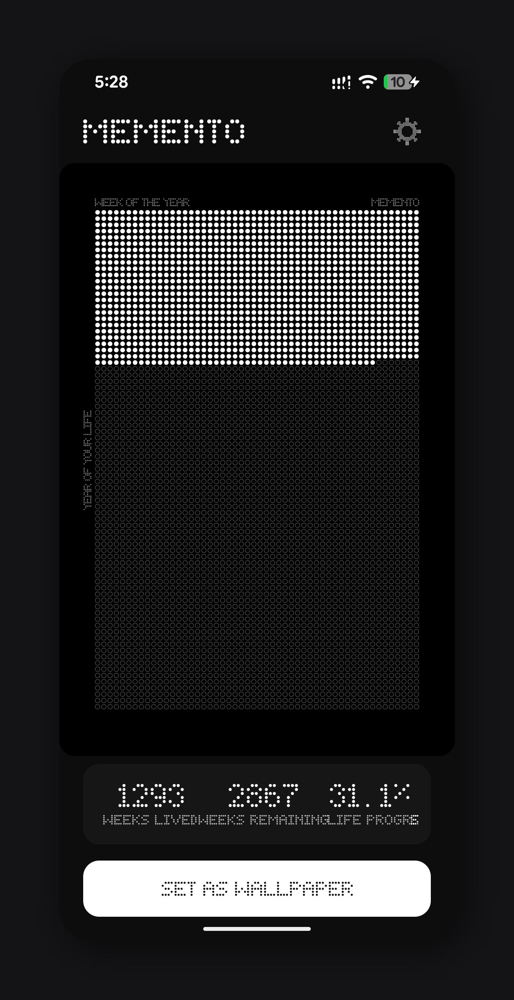

<h1 align="center">Memento</h1>

<p align="center">
  <i>Minimalist Android wallpapers for mindful living. Visualize your life progress right on your home screen.</i>
</p>

<p align="center">
  
  &nbsp;&nbsp;&nbsp;&nbsp;
  
</p>

<br>

## The Philosophy

Inspired by [The Life Calendar](https://thelifecalendar.com/), [Wait But Why's Life in Weeks](https://waitbutwhy.com/2014/05/life-weeks.html), and [@luismbat's concepts](https://x.com/luismbat). 

Time is our most scarce resource, yet we rarely acknowledge it. Memento transforms your Android wallpaper into a continuous, minimalist visualization of your life in weeks:
- **Filled dots** represent the weeks you've already lived.
- **Empty dots** represent the remaining weeks based on your life expectancy.

Every week, your wallpaper updates seamlessly in the background. It's a gentle, persistent reminder to make the upcoming week count.

## Features

- 📅 **Visualize Your Journey** — See your entire life map at a glance.
- 🎨 **Premium Aesthetic** — Minimalist, high-fidelity dot-matrix rendering.
- 🔋 **Zero Distraction, Zero Drain** — Updates automatically once a week using efficient Android `WorkManager` APIs.
- ✨ **Customizable Design** — Toggle between Dark and Light themes. Choose from custom dot aesthetics like *Circle*, *Ring*, *Square*, or *Diamond*.

## Installation

### Get the App (Recommended)

1. Download the latest APK from the [Releases](https://github.com/dharmveerjakhar/memento/releases) page.
2. Transfer it to your Android device and install (ensure "Install from Unknown Sources" is enabled in your security settings).
3. Open the app, set your birth date and life expectancy, and tap **"Set As Wallpaper"**.

### Build from Source

**Requirements:**
- Android Studio Hedgehog (2023.1.1) or newer
- JDK 17
- Android SDK 35

```bash
# Clone the repository
git clone https://github.com/dharmveerjakhar/memento.git
cd memento

# Build debug APK
./gradlew assembleDebug

# Install on connected device
./gradlew installDebug
```

## How It Works Under the Hood
1. **Data State**: Open the beautifully crafted Compose UI to input your birth date and timeline.
2. **Generation**: A highly optimized `CalendarImageGenerator` draws your entire life grid using the native `Canvas` API directly to a bitmap, perfectly scaled for your screen's aspect ratio.
3. **Wallpaper Engine**: Instantly binds the final bitmap to your system's Home, Lock, or Dual screens without incurring continuous battery drain.
4. **Auto-update Worker**: A scheduled Android `PeriodicWorkRequest` automatically runs completely silently every 7 days to repaint your life journey exactly at the turn of your new week.

## License & Acknowledgments

This project is fully open source and licensed under the MIT License - see [LICENSE](LICENSE) for details.

- Designed initially from the [Wait But Why](https://waitbutwhy.com/) philosophy.
- Premium UI/UX inspirations curated from [The Life Calendar](https://thelifecalendar.com/).
